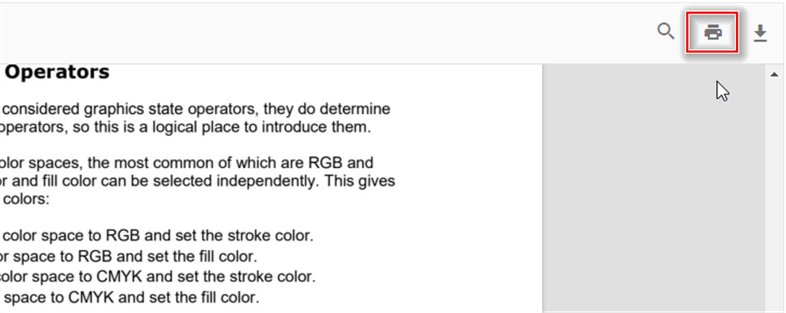

# Print

The PDF Viewer supports printing the loaded PDF file. You can enable/disable the print using the following code snippet.

```html
<!DOCTYPE html>
<html lang="en">

<head>
    <title>Essential JS 2</title>
    <meta charset="utf-8" />
    <meta name="viewport" content="width=device-width, initial-scale=1.0, user-scalable=no" />
    <meta name="description" content="Essential JS 2" />
    <meta name="author" content="Syncfusion" />
    <link rel="shortcut icon" href="resources/favicon.ico" />
    <link href="https://maxcdn.bootstrapcdn.com/bootstrap/3.3.7/css/bootstrap.min.css" rel="stylesheet" />

    <!--style reference from app-->
    <link href="/styles/styles.css" rel="stylesheet" />

    <!--system js reference and configuration-->
    <script src="node_modules/systemjs/dist/system.src.js" type="text/javascript"></script>
    <script src="system.config.js" type="text/javascript"></script>
</head>

<body>
    <!--Element which will render as PdfViewer -->
    <div id="PdfViewer"></div>
</body>

</html>
```

```typescript
import { PdfViewer, Toolbar, Magnification, Navigation, LinkAnnotation, Annotation, ThumbnailView,BookmarkView, TextSelection} from '@syncfusion/ej2-pdfviewer';

PdfViewer.Inject(Toolbar,Magnification,Navigation, LinkAnnotation, Annotation, ThumbnailView,BookmarkView, TextSelection);

let pdfviewer: PdfViewer = new PdfViewer({enablePrint: true, documentPath:'PDF_Succinctly.pdf'});
pdfviewer.serviceUrl = 'https://ej2services.syncfusion.com/production/web-services/api/pdfviewer';
pdfviewer.appendTo('#PdfViewer');

```



You can invoke print action using the following code snippet.,

```html
<template>
  <div id="app">
    <ejs-button ref="printBtn" v-on:click.native="printClicked">Print</ejs-button>
    <ejs-pdfviewer id="pdfViewer" ref="pdfviewer" :serviceUrl="serviceUrl" :documentPath="documentPath" :documentLoad="documentLoad"> </ejs-pdfviewer>
  </div>
</template>

<script>
import Vue from 'vue';
import { PdfViewerPlugin, Toolbar, Magnification, Navigation, LinkAnnotation, Annotation, BookmarkView, ThumbnailView, Print, TextSelection, TextSearch } from '@syncfusion/ej2-vue-pdfviewer';
import { ButtonPlugin } from "@syncfusion/ej2-vue-buttons";
Vue.use(ButtonPlugin);
Vue.use(PdfViewerPlugin);
var viewer;
export default {
  name: 'app',
  data () {
    return {
      serviceUrl:"https://ej2services.syncfusion.com/production/web-services/api/pdfviewer"
      documentPath:"PDF_Succinctly.pdf"
      };
      },
  provide: {
    PdfViewer: [Toolbar, Magnification, Navigation, LinkAnnotation, BookmarkView, Annotation, ThumbnailView, Print, TextSelection, TextSearch]
  },  
  methods: {
            printClicked: function (args) {
                viewer.print();
            },
            documentLoad: function (args) {
                viewer = this.$refs.pdfviewer.ej2Instances;
            },
  }
}
</script>

```

## See also

* [Toolbar items](/toolbar)
* [Feature Modules](/feature-module)